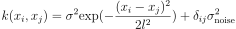
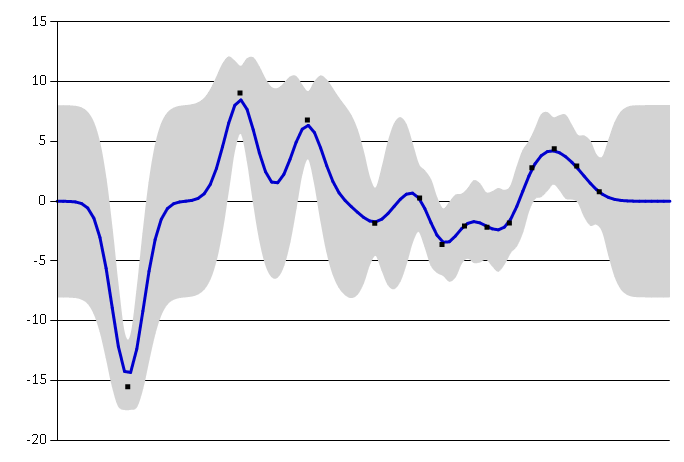
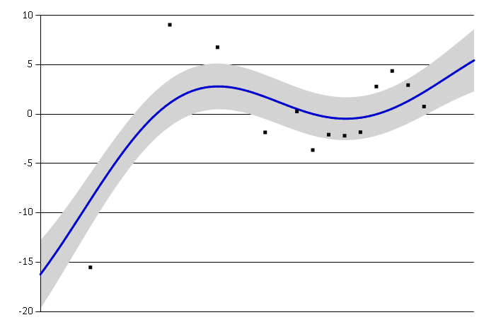
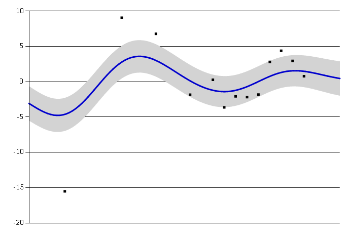
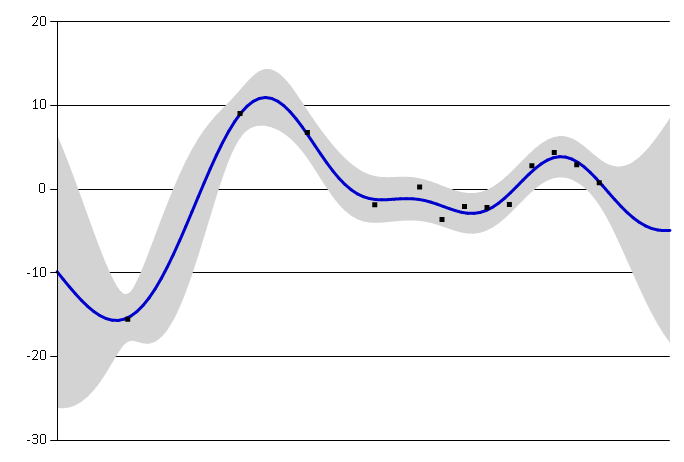
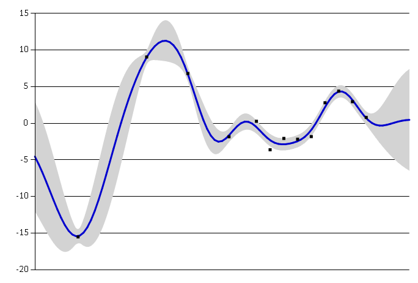
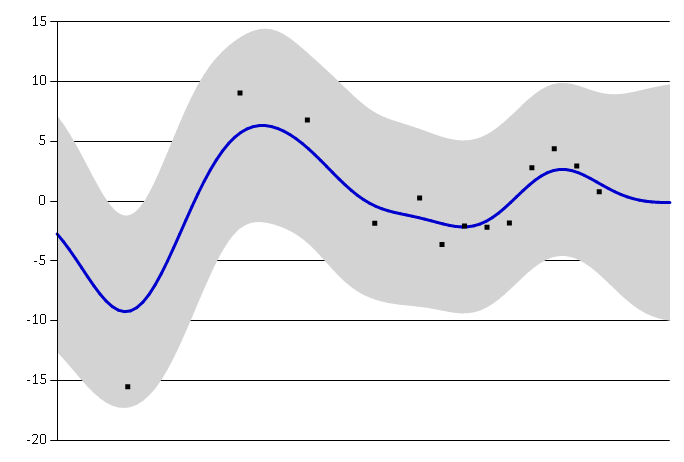

# Squared Exponential Kernel

where &sigma;2 is the signal variance, l>0 is the lengthscale and &sigma;noise2&geq;0 is the noise variance. The noise variance is applied only when i=j.

Squared exponential is appropriate for modelling very smooth functions. The parameters have the following interpretation:

- **Lengthscale** l describes how smooth a function is. Small lengthscale value means that function values can change quickly, large values characterize f

small lengthscale

large lengthscale

- **Signal variance** &sigma;2 is a scaling factor. It determines variation of function values from their mean. Small value of &sigma;2 characterize functions that stay close to their mean value, larger values allow more variation. If the signal variance is too large, the modelled function will be free to chase outliers.

small signal variance

large signal variance

- **Noise variance** &sigma;noise2 is formally not a part of the covariance function itself. It is used by the Gaussian process model to allow for noise present in training data. This parameter specifies how much noise is expected to be present in the data.

small noise variance

large noise variance

## Reference

[1] http://evelinag.com/Ariadne/covarianceFunctions.html
